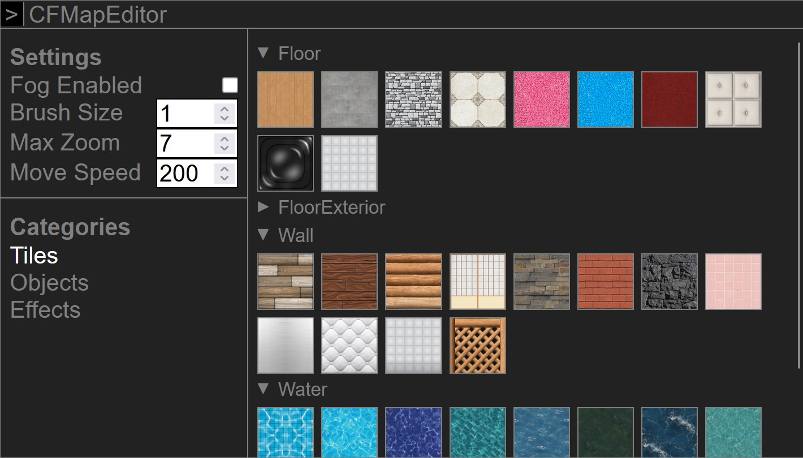

<h1 align="center">map editor</h1>
<p align="center">
    an <i>arguably</i> better editor ui for map view<br/>
    
</p>

<h3 align="center">description</h1>
<p align="center">
    introduces a collapsible overlay over the chat log allowing selection of the various different tiles and objects that can be placed on the map, and hides the default clunky one.
</p>

<h3 align="center">usage</h3>
<p align="center">enter a map room with admin access, the editor will open automatically!</p>

<h3 align="center">installation</h1>
<div align="center"><sup>(pick from whichever git host you prefer)</sup></div>

```js
// GitHub
javascript:(()=>{import("https://tenjou-no-kitsune.github.io/cfme/main.js")})();
// GitGud
javascript:(()=>{import("https://tengoku.gitgud.site/cfme/main.js")})();
```

<h3 align="center">uninstallation</h3>
<p align="center">just run <b>/cfme unload</b> in the chat</p>